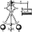

<!DOCTYPE html>
<!-- saved from url=(0070)https://github.com/Medium/opensource/blob/master/apache-license-2.0.md -->
<html lang="en"><head><meta http-equiv="Content-Type" content="text/html; charset=UTF-8">

  <link crossorigin="anonymous" href="./LICENSE_files/frameworks-d48d0c441ed0ab66aa7d582c5aaf762f4a1eef9a915871a36ddb07e71b01ffb2.css" integrity="sha256-1I0MRB7Qq2aqfVgsWq92L0oe75qRWHGjbdsH5xsB/7I=" media="all" rel="stylesheet">
  <link crossorigin="anonymous" href="./LICENSE_files/github-a6456108ae38d5ef012503fd17ca8d53dc8721f183c4cbff9418f8513ec0d238.css" integrity="sha256-pkVhCK441e8BJQP9F8qNU9yHIfGDxMv/lBj4UT7A0jg=" media="all" rel="stylesheet">

  <meta name="viewport" content="width=device-width">

  <title>opensource/apache-license-2.0.md at master · Medium/opensource</title>
  <link rel="search" type="application/opensearchdescription+xml" href="https://github.com/opensearch.xml" title="GitHub">
  <link rel="fluid-icon" href="https://github.com/fluidicon.png" title="GitHub">
  <meta property="fb:app_id" content="1401488693436528">

    <meta content="https://avatars0.githubusercontent.com/u/923954?v=3&amp;s=400" property="og:image"><meta content="GitHub" property="og:site_name"><meta content="object" property="og:type"><meta content="Medium/opensource" property="og:title"><meta content="https://github.com/Medium/opensource" property="og:url"><meta content="opensource - Umbrella project for open source efforts at Medium" property="og:description">

  <link rel="assets" href="https://assets-cdn.github.com/">
  <link rel="web-socket" href="wss://live.github.com/_sockets/VjI6MTc4NjQxMzI0OmJmMjYzNDMzOTg3MjZiZTk5ZGFmMzJhYmFjM2U5OGM2MTFiMWRmN2ZkODVmYzRhN2Y3YmZlZTYyYmQ3M2YxZTI=--42091489a68b2278ab63232e9a0c0fa8d04859c0">
  <meta name="pjax-timeout" content="1000">
  <link rel="sudo-modal" href="https://github.com/sessions/sudo_modal">
  <meta name="request-id" content="16E9:2E0E5:59898D7:861EA37:593436F0" data-pjax-transient="">

  <meta name="selected-link" value="repo_source" data-pjax-transient="">

  <meta name="google-site-verification" content="KT5gs8h0wvaagLKAVWq8bbeNwnZZK1r1XQysX3xurLU">
<meta name="google-site-verification" content="ZzhVyEFwb7w3e0-uOTltm8Jsck2F5StVihD0exw2fsA">
    <meta name="google-analytics" content="UA-3769691-2">

<meta content="collector.githubapp.com" name="octolytics-host"><meta content="github" name="octolytics-app-id"><meta content="https://collector.githubapp.com/github-external/browser_event" name="octolytics-event-url"><meta content="16E9:2E0E5:59898D7:861EA37:593436F0" name="octolytics-dimension-request_id"><meta content="iad" name="octolytics-dimension-region_edge"><meta content="iad" name="octolytics-dimension-region_render"><meta content="966542" name="octolytics-actor-id"><meta content="cypherhat" name="octolytics-actor-login"><meta content="672a9d12b4affe43552e6be280ebba05dff19e47e8cfb1394eede05fac9ea775" name="octolytics-actor-hash">
<meta content="/&lt;user-name&gt;/&lt;repo-name&gt;/blob/show" data-pjax-transient="true" name="analytics-location">

  <meta class="js-ga-set" name="dimension1" content="Logged In">

      <meta name="hostname" content="github.com">
  <meta name="user-login" content="cypherhat">

      <meta name="expected-hostname" content="github.com">
    <meta name="js-proxy-site-detection-payload" content="YWJlMmYwNGMxYzRmZjRmZWQ4NTI2M2Y4OGY3Njg4NDIwYTk4YWFhMjk2MDExZGIzMmU3OTZiZGE0NDI2YzY5Znx7InJlbW90ZV9hZGRyZXNzIjoiMTc0LjIwNC4zLjI0OSIsInJlcXVlc3RfaWQiOiIxNkU5OjJFMEU1OjU5ODk4RDc6ODYxRUEzNzo1OTM0MzZGMCIsInRpbWVzdGFtcCI6MTQ5NjU5NDE2MCwiaG9zdCI6ImdpdGh1Yi5jb20ifQ==">

  <meta name="html-safe-nonce" content="934a66cbf71c036b33065a1fb802548ba7bfe76c">

  <meta http-equiv="x-pjax-version" content="f2a391d84c9a9c3816af1e59762eebc9">

  <meta name="description" content="opensource - Umbrella project for open source efforts at Medium">
  <meta name="go-import" content="github.com/Medium/opensource git https://github.com/Medium/opensource.git">

  <meta content="923954" name="octolytics-dimension-user_id"><meta content="Medium" name="octolytics-dimension-user_login"><meta content="4874468" name="octolytics-dimension-repository_id"><meta content="Medium/opensource" name="octolytics-dimension-repository_nwo"><meta content="true" name="octolytics-dimension-repository_public"><meta content="false" name="octolytics-dimension-repository_is_fork"><meta content="4874468" name="octolytics-dimension-repository_network_root_id"><meta content="Medium/opensource" name="octolytics-dimension-repository_network_root_nwo"><meta content="false" name="octolytics-dimension-repository_explore_github_marketplace_ci_cta_shown">
  <link href="https://github.com/Medium/opensource/commits/master.atom" rel="alternate" title="Recent Commits to opensource:master" type="application/atom+xml">

    <link rel="canonical" href="https://github.com/Medium/opensource/blob/master/apache-license-2.0.md" data-pjax-transient="">

  <meta name="browser-stats-url" content="https://api.github.com/_private/browser/stats">

  <meta name="browser-errors-url" content="https://api.github.com/_private/browser/errors">

  <link rel="mask-icon" href="https://assets-cdn.github.com/pinned-octocat.svg" color="#000000">
  <link rel="icon" type="image/x-icon" href="https://assets-cdn.github.com/favicon.ico">

<meta name="theme-color" content="#1e2327">

  <meta name="u2f-support" content="true">

  </head>

  <body class="logged-in env-production emoji-size-boost page-blob">

  

    <a href="https://github.com/Medium/opensource/blob/master/apache-license-2.0.md#start-of-content" tabindex="1" class="accessibility-aid js-skip-to-content">Skip to content</a>
    

  

    <a class="header-logo-invertocat" href="https://github.com/orgs/immutability-io/dashboard" data-hotkey="g d" aria-label="Homepage" data-ga-click="Header, go to dashboard, icon:logo">
  <svg aria-hidden="true" class="octicon octicon-mark-github" height="32" version="1.1" viewBox="0 0 16 16" width="32"><path fill-rule="evenodd" d="M8 0C3.58 0 0 3.58 0 8c0 3.54 2.29 6.53 5.47 7.59.4.07.55-.17.55-.38 0-.19-.01-.82-.01-1.49-2.01.37-2.53-.49-2.69-.94-.09-.23-.48-.94-.82-1.13-.28-.15-.68-.52-.01-.53.63-.01 1.08.58 1.23.82.72 1.21 1.87.87 2.33.66.07-.52.28-.87.51-1.07-1.78-.2-3.64-.89-3.64-3.95 0-.87.31-1.59.82-2.15-.08-.2-.36-1.02.08-2.12 0 0 .67-.21 2.2.82.64-.18 1.32-.27 2-.27.68 0 1.36.09 2 .27 1.53-1.04 2.2-.82 2.2-.82.44 1.1.16 1.92.08 2.12.51.56.82 1.27.82 2.15 0 3.07-1.87 3.75-3.65 3.95.29.25.54.73.54 1.48 0 1.07-.01 1.93-.01 2.2 0 .21.15.46.55.38A8.013 8.013 0 0 0 16 8c0-4.42-3.58-8-8-8z"></path></svg>
</a>

        

  <!-- '"` --><!-- </textarea></xmp> --><form accept-charset="UTF-8" action="https://github.com/Medium/opensource/search" class="js-site-search-form" data-scoped-search-url="/Medium/opensource/search" data-unscoped-search-url="/search" method="get">
<input name="utf8" type="hidden" value="✓">

    <label class="form-control header-search-wrapper js-chromeless-input-container">
        <a href="https://github.com/Medium/opensource/blob/master/apache-license-2.0.md" class="header-search-scope no-underline">This repository</a>
      <input type="text" class="form-control header-search-input js-site-search-focus js-site-search-field is-clearable" data-hotkey="s" name="q" value="" placeholder="Search" aria-label="Search this repository" data-unscoped-placeholder="Search GitHub" data-scoped-placeholder="Search" autocapitalize="off">
        <input type="hidden" class="js-site-search-type-field" name="type">
    </label>
</form>

      <ul class="header-nav float-left" role="navigation">
        <li class="header-nav-item">
          <a href="https://github.com/pulls" aria-label="Pull requests you created" class="js-selected-navigation-item header-nav-link" data-ga-click="Header, click, Nav menu - item:pulls context:user" data-hotkey="g p" data-selected-links="/pulls /pulls/assigned /pulls/mentioned /pulls">
            Pull requests
</a>        </li>
        <li class="header-nav-item">
          <a href="https://github.com/issues" aria-label="Issues you created" class="js-selected-navigation-item header-nav-link" data-ga-click="Header, click, Nav menu - item:issues context:user" data-hotkey="g i" data-selected-links="/issues /issues/assigned /issues/mentioned /issues">
            Issues
</a>        </li>
            <li class="header-nav-item">
              <a href="https://github.com/marketplace" class="js-selected-navigation-item header-nav-link" data-ga-click="Header, click, Nav menu - item:marketplace context:user" data-selected-links=" /marketplace">
                Marketplace
</a>            </li>
          <li class="header-nav-item">
            <a class="header-nav-link" href="https://gist.github.com/" data-ga-click="Header, go to gist, text:gist">Gist</a>
          </li>
      </ul>

<ul class="header-nav user-nav float-right" id="user-links">
  <li class="header-nav-item">

    <a href="https://github.com/notifications" aria-label="You have unread notifications" class="header-nav-link notification-indicator tooltipped tooltipped-s js-socket-channel js-notification-indicator " data-channel="notification-changed:966542" data-ga-click="Header, go to notifications, icon:unread" data-hotkey="g n">
        
        <svg aria-hidden="true" class="octicon octicon-bell float-left" height="16" version="1.1" viewBox="0 0 14 16" width="14"><path fill-rule="evenodd" d="M14 12v1H0v-1l.73-.58c.77-.77.81-2.55 1.19-4.42C2.69 3.23 6 2 6 2c0-.55.45-1 1-1s1 .45 1 1c0 0 3.39 1.23 4.16 5 .38 1.88.42 3.66 1.19 4.42l.66.58H14zm-7 4c1.11 0 2-.89 2-2H5c0 1.11.89 2 2 2z"></path></svg>
</a>
  </li>

  <li class="header-nav-item dropdown js-menu-container">
    <a class="header-nav-link tooltipped tooltipped-s js-menu-target" href="https://github.com/new" aria-label="Create new…" data-ga-click="Header, create new, icon:add">
      <svg aria-hidden="true" class="octicon octicon-plus float-left" height="16" version="1.1" viewBox="0 0 12 16" width="12"><path fill-rule="evenodd" d="M12 9H7v5H5V9H0V7h5V2h2v5h5z"></path></svg>
      
    </a>

    

      <ul class="dropdown-menu dropdown-menu-sw">

<a class="dropdown-item" href="https://github.com/new" data-ga-click="Header, create new repository">
  New repository
</a>

  <a class="dropdown-item" href="https://github.com/new/import" data-ga-click="Header, import a repository">
    Import repository
  </a>

<a class="dropdown-item" href="https://gist.github.com/" data-ga-click="Header, create new gist">
  New gist
</a>

  <a class="dropdown-item" href="https://github.com/organizations/new" data-ga-click="Header, create new organization">
    New organization
  </a>

  

  

    This repository
  

    <a class="dropdown-item" href="https://github.com/Medium/opensource/issues/new" data-ga-click="Header, create new issue">
      New issue
    </a>

      </ul>
    

  </li>

  <li class="header-nav-item dropdown js-menu-container">
    <a class="header-nav-link name tooltipped tooltipped-sw js-menu-target" href="https://github.com/cypherhat" aria-label="View profile and more" data-ga-click="Header, show menu, icon:avatar">
      
      
    </a>

    

      

        

          Signed in as <strong class="css-truncate-target">cypherhat</strong>
        

        

        <a class="dropdown-item" href="https://github.com/cypherhat" data-ga-click="Header, go to profile, text:your profile">
          Your profile
        </a>
        <a class="dropdown-item" href="https://github.com/cypherhat?tab=stars" data-ga-click="Header, go to starred repos, text:your stars">
          Your stars
        </a>
        <a class="dropdown-item" href="https://github.com/explore" data-ga-click="Header, go to explore, text:explore">
          Explore
        </a>
        <a class="dropdown-item" href="https://help.github.com/" data-ga-click="Header, go to help, text:help">
          Help
        </a>

        

        <a class="dropdown-item" href="https://github.com/settings/profile" data-ga-click="Header, go to settings, icon:settings">
          Settings
        </a>

        <!-- '"` --><!-- </textarea></xmp> --><form accept-charset="UTF-8" action="https://github.com/logout" class="logout-form" method="post">
<input name="utf8" type="hidden" value="✓"><input name="authenticity_token" type="hidden" value="LsM+DH48OcfgvMTm3sQTF7cEVWCW3ULqBPdrcvnWyFTNP46s0XdicqhEEsiPJ8ylY8ybOJaOnnq1Tonf383OZw==">

          <button type="submit" class="dropdown-item dropdown-signout" data-ga-click="Header, sign out, icon:logout">
            Sign out
          </button>
</form>      

    

  </li>
</ul>

    <!-- '"` --><!-- </textarea></xmp> --><form accept-charset="UTF-8" action="https://github.com/logout" class="sr-only right-0" method="post">
<input name="utf8" type="hidden" value="✓"><input name="authenticity_token" type="hidden" value="XwOyQcEn50Pw297LQFRyL+8flr79ieaX/NVA9j4Lv0q8/wLhbmy89rgjCOURt62dO9dY5v3aOgdNbKJbGBC5eQ==">

      <button type="submit" class="dropdown-item dropdown-signout" data-ga-click="Header, sign out, icon:logout">
        Sign out
      </button>
</form>  

  

  

    

  

        

    

    

      

        <ul class="pagehead-actions">
  <li>
        <!-- '"` --><!-- </textarea></xmp> --><form accept-charset="UTF-8" action="https://github.com/notifications/subscribe" class="js-social-container" data-autosubmit="true" data-remote="true" method="post">
<input name="utf8" type="hidden" value="✓"><input name="authenticity_token" type="hidden" value="tEO6hrKbTodqVfaak6EzHkf/FrZD8+VXuBvL81Yh66U/l3HbvpZtdN3aIrOq54JrGNoq0T4NKlxC6dIzaQ5L6w==">
      <input class="form-control" id="repository_id" name="repository_id" type="hidden" value="4874468">

        

          <a href="https://github.com/Medium/opensource/subscription" class="btn btn-sm btn-with-count select-menu-button js-menu-target" role="button" tabindex="0" aria-haspopup="true" data-ga-click="Repository, click Watch settings, action:blob#show">
            
                <svg aria-hidden="true" class="octicon octicon-eye" height="16" version="1.1" viewBox="0 0 16 16" width="16"><path fill-rule="evenodd" d="M8.06 2C3 2 0 8 0 8s3 6 8.06 6C13 14 16 8 16 8s-3-6-7.94-6zM8 12c-2.2 0-4-1.78-4-4 0-2.2 1.8-4 4-4 2.22 0 4 1.8 4 4 0 2.22-1.78 4-4 4zm2-4c0 1.11-.89 2-2 2-1.11 0-2-.89-2-2 0-1.11.89-2 2-2 1.11 0 2 .89 2 2z"></path></svg>
                Watch
            
          </a>
            <a class="social-count js-social-count" href="https://github.com/Medium/opensource/watchers" aria-label="130 users are watching this repository">
              130
            </a>

        

          

            

              <svg aria-label="Close" class="octicon octicon-x js-menu-close" height="16" role="img" version="1.1" viewBox="0 0 12 16" width="12"><path fill-rule="evenodd" d="M7.48 8l3.75 3.75-1.48 1.48L6 9.48l-3.75 3.75-1.48-1.48L4.52 8 .77 4.25l1.48-1.48L6 6.52l3.75-3.75 1.48 1.48z"></path></svg>
              Notifications
            

              

                

                  <svg aria-hidden="true" class="octicon octicon-check select-menu-item-icon" height="16" version="1.1" viewBox="0 0 12 16" width="12"><path fill-rule="evenodd" d="M12 5l-8 8-4-4 1.5-1.5L4 10l6.5-6.5z"></path></svg>
                  

                    <input checked="checked" id="do_included" name="do" type="radio" value="included">
                    Not watching
                    Be notified when participating or @mentioned.
                    
                      <svg aria-hidden="true" class="octicon octicon-eye" height="16" version="1.1" viewBox="0 0 16 16" width="16"><path fill-rule="evenodd" d="M8.06 2C3 2 0 8 0 8s3 6 8.06 6C13 14 16 8 16 8s-3-6-7.94-6zM8 12c-2.2 0-4-1.78-4-4 0-2.2 1.8-4 4-4 2.22 0 4 1.8 4 4 0 2.22-1.78 4-4 4zm2-4c0 1.11-.89 2-2 2-1.11 0-2-.89-2-2 0-1.11.89-2 2-2 1.11 0 2 .89 2 2z"></path></svg>
                      Watch
                    
                  

                

                

                  <svg aria-hidden="true" class="octicon octicon-check select-menu-item-icon" height="16" version="1.1" viewBox="0 0 12 16" width="12"><path fill-rule="evenodd" d="M12 5l-8 8-4-4 1.5-1.5L4 10l6.5-6.5z"></path></svg>
                  

                    <input id="do_subscribed" name="do" type="radio" value="subscribed">
                    Watching
                    Be notified of all conversations.
                    
                      <svg aria-hidden="true" class="octicon octicon-eye" height="16" version="1.1" viewBox="0 0 16 16" width="16"><path fill-rule="evenodd" d="M8.06 2C3 2 0 8 0 8s3 6 8.06 6C13 14 16 8 16 8s-3-6-7.94-6zM8 12c-2.2 0-4-1.78-4-4 0-2.2 1.8-4 4-4 2.22 0 4 1.8 4 4 0 2.22-1.78 4-4 4zm2-4c0 1.11-.89 2-2 2-1.11 0-2-.89-2-2 0-1.11.89-2 2-2 1.11 0 2 .89 2 2z"></path></svg>
                        Unwatch
                    
                  

                

                

                  <svg aria-hidden="true" class="octicon octicon-check select-menu-item-icon" height="16" version="1.1" viewBox="0 0 12 16" width="12"><path fill-rule="evenodd" d="M12 5l-8 8-4-4 1.5-1.5L4 10l6.5-6.5z"></path></svg>
                  

                    <input id="do_ignore" name="do" type="radio" value="ignore">
                    Ignoring
                    Never be notified.
                    
                      <svg aria-hidden="true" class="octicon octicon-mute" height="16" version="1.1" viewBox="0 0 16 16" width="16"><path fill-rule="evenodd" d="M8 2.81v10.38c0 .67-.81 1-1.28.53L3 10H1c-.55 0-1-.45-1-1V7c0-.55.45-1 1-1h2l3.72-3.72C7.19 1.81 8 2.14 8 2.81zm7.53 3.22l-1.06-1.06-1.97 1.97-1.97-1.97-1.06 1.06L11.44 8 9.47 9.97l1.06 1.06 1.97-1.97 1.97 1.97 1.06-1.06L13.56 8l1.97-1.97z"></path></svg>
                        Stop ignoring
                    
                  

                

              

            

          

        

</form>
  </li>

  <li>
      

    <!-- '"` --><!-- </textarea></xmp> --><form accept-charset="UTF-8" action="https://github.com/Medium/opensource/unstar" class="starred" data-remote="true" method="post">
<input name="utf8" type="hidden" value="✓"><input name="authenticity_token" type="hidden" value="qaY6jlxF9bYaoViNhUzzXnlqGKVH34HoQg1gsCtah8GPVPX3pyeGlhy91bUrfafLQkfjr43rcfhamePLiA3vug==">

      <button type="submit" class="btn btn-sm btn-with-count js-toggler-target" aria-label="Unstar this repository" title="Unstar Medium/opensource" data-ga-click="Repository, click unstar button, action:blob#show; text:Unstar">
        <svg aria-hidden="true" class="octicon octicon-star" height="16" version="1.1" viewBox="0 0 14 16" width="14"><path fill-rule="evenodd" d="M14 6l-4.9-.64L7 1 4.9 5.36 0 6l3.6 3.26L2.67 14 7 11.67 11.33 14l-.93-4.74z"></path></svg>
        Unstar
      </button>
        <a class="social-count js-social-count" href="https://github.com/Medium/opensource/stargazers" aria-label="243 users starred this repository">
          243
        </a>
</form>
    <!-- '"` --><!-- </textarea></xmp> --><form accept-charset="UTF-8" action="https://github.com/Medium/opensource/star" class="unstarred" data-remote="true" method="post">
<input name="utf8" type="hidden" value="✓"><input name="authenticity_token" type="hidden" value="GcIxbOpRieqn3nKENC901gsdJDyrnlBWn4Ev9Qij5FtXg99DHbS5tsBAXyzrcfOisMK1mN3QG+gELbHub6/XwA==">

      <button type="submit" class="btn btn-sm btn-with-count js-toggler-target" aria-label="Star this repository" title="Star Medium/opensource" data-ga-click="Repository, click star button, action:blob#show; text:Star">
        <svg aria-hidden="true" class="octicon octicon-star" height="16" version="1.1" viewBox="0 0 14 16" width="14"><path fill-rule="evenodd" d="M14 6l-4.9-.64L7 1 4.9 5.36 0 6l3.6 3.26L2.67 14 7 11.67 11.33 14l-.93-4.74z"></path></svg>
        Star
      </button>
        <a class="social-count js-social-count" href="https://github.com/Medium/opensource/stargazers" aria-label="243 users starred this repository">
          243
        </a>
</form>  

  </li>

  <li>
          <a href="https://github.com/Medium/opensource/blob/master/apache-license-2.0.md#fork-destination-box" class="btn btn-sm btn-with-count" title="Fork your own copy of Medium/opensource to your account" aria-label="Fork your own copy of Medium/opensource to your account" rel="facebox" data-ga-click="Repository, show fork modal, action:blob#show; text:Fork">
              <svg aria-hidden="true" class="octicon octicon-repo-forked" height="16" version="1.1" viewBox="0 0 10 16" width="10"><path fill-rule="evenodd" d="M8 1a1.993 1.993 0 0 0-1 3.72V6L5 8 3 6V4.72A1.993 1.993 0 0 0 2 1a1.993 1.993 0 0 0-1 3.72V6.5l3 3v1.78A1.993 1.993 0 0 0 5 15a1.993 1.993 0 0 0 1-3.72V9.5l3-3V4.72A1.993 1.993 0 0 0 8 1zM2 4.2C1.34 4.2.8 3.65.8 3c0-.65.55-1.2 1.2-1.2.65 0 1.2.55 1.2 1.2 0 .65-.55 1.2-1.2 1.2zm3 10c-.66 0-1.2-.55-1.2-1.2 0-.65.55-1.2 1.2-1.2.65 0 1.2.55 1.2 1.2 0 .65-.55 1.2-1.2 1.2zm3-10c-.66 0-1.2-.55-1.2-1.2 0-.65.55-1.2 1.2-1.2.65 0 1.2.55 1.2 1.2 0 .65-.55 1.2-1.2 1.2z"></path></svg>
            Fork
          </a>

          

            <h2 class="facebox-header" data-facebox-id="facebox-header">Where should we fork this repository?</h2>
            <include-fragment src="" class="js-fork-select-fragment fork-select-fragment" data-url="/Medium/opensource/fork?fragment=1">
              
            </include-fragment>
          

    <a href="https://github.com/Medium/opensource/network" class="social-count" aria-label="111 users forked this repository">
      111
    </a>
  </li>
</ul>

        <h1 class="public ">
  <svg aria-hidden="true" class="octicon octicon-repo" height="16" version="1.1" viewBox="0 0 12 16" width="12"><path fill-rule="evenodd" d="M4 9H3V8h1v1zm0-3H3v1h1V6zm0-2H3v1h1V4zm0-2H3v1h1V2zm8-1v12c0 .55-.45 1-1 1H6v2l-1.5-1.5L3 16v-2H1c-.55 0-1-.45-1-1V1c0-.55.45-1 1-1h10c.55 0 1 .45 1 1zm-1 10H1v2h2v-1h3v1h5v-2zm0-10H2v9h9V1z"></path></svg>
  <a href="https://github.com/Medium" class="url fn" rel="author">Medium</a><!--
-->/<!--
--><strong itemprop="name"><a href="https://github.com/Medium/opensource" data-pjax="#js-repo-pjax-container">opensource</a></strong>

</h1>

      

      

<nav class="reponav js-repo-nav js-sidenav-container-pjax" itemscope="" itemtype="http://schema.org/BreadcrumbList" role="navigation" data-pjax="#js-repo-pjax-container">

  
    <a href="https://github.com/Medium/opensource" class="js-selected-navigation-item selected reponav-item" data-hotkey="g c" data-selected-links="repo_source repo_downloads repo_commits repo_releases repo_tags repo_branches /Medium/opensource" itemprop="url">
      <svg aria-hidden="true" class="octicon octicon-code" height="16" version="1.1" viewBox="0 0 14 16" width="14"><path fill-rule="evenodd" d="M9.5 3L8 4.5 11.5 8 8 11.5 9.5 13 14 8 9.5 3zm-5 0L0 8l4.5 5L6 11.5 2.5 8 6 4.5 4.5 3z"></path></svg>
      Code
      <meta itemprop="position" content="1">
</a>  

    
      <a href="https://github.com/Medium/opensource/issues" class="js-selected-navigation-item reponav-item" data-hotkey="g i" data-selected-links="repo_issues repo_labels repo_milestones /Medium/opensource/issues" itemprop="url">
        <svg aria-hidden="true" class="octicon octicon-issue-opened" height="16" version="1.1" viewBox="0 0 14 16" width="14"><path fill-rule="evenodd" d="M7 2.3c3.14 0 5.7 2.56 5.7 5.7s-2.56 5.7-5.7 5.7A5.71 5.71 0 0 1 1.3 8c0-3.14 2.56-5.7 5.7-5.7zM7 1C3.14 1 0 4.14 0 8s3.14 7 7 7 7-3.14 7-7-3.14-7-7-7zm1 3H6v5h2V4zm0 6H6v2h2v-2z"></path></svg>
        Issues
        0
        <meta itemprop="position" content="2">
</a>    

  
    <a href="https://github.com/Medium/opensource/pulls" class="js-selected-navigation-item reponav-item" data-hotkey="g p" data-selected-links="repo_pulls /Medium/opensource/pulls" itemprop="url">
      <svg aria-hidden="true" class="octicon octicon-git-pull-request" height="16" version="1.1" viewBox="0 0 12 16" width="12"><path fill-rule="evenodd" d="M11 11.28V5c-.03-.78-.34-1.47-.94-2.06C9.46 2.35 8.78 2.03 8 2H7V0L4 3l3 3V4h1c.27.02.48.11.69.31.21.2.3.42.31.69v6.28A1.993 1.993 0 0 0 10 15a1.993 1.993 0 0 0 1-3.72zm-1 2.92c-.66 0-1.2-.55-1.2-1.2 0-.65.55-1.2 1.2-1.2.65 0 1.2.55 1.2 1.2 0 .65-.55 1.2-1.2 1.2zM4 3c0-1.11-.89-2-2-2a1.993 1.993 0 0 0-1 3.72v6.56A1.993 1.993 0 0 0 2 15a1.993 1.993 0 0 0 1-3.72V4.72c.59-.34 1-.98 1-1.72zm-.8 10c0 .66-.55 1.2-1.2 1.2-.65 0-1.2-.55-1.2-1.2 0-.65.55-1.2 1.2-1.2.65 0 1.2.55 1.2 1.2zM2 4.2C1.34 4.2.8 3.65.8 3c0-.65.55-1.2 1.2-1.2.65 0 1.2.55 1.2 1.2 0 .65-.55 1.2-1.2 1.2z"></path></svg>
      Pull requests
      2
      <meta itemprop="position" content="3">
</a>  

    <a href="https://github.com/Medium/opensource/projects" class="js-selected-navigation-item reponav-item" data-selected-links="repo_projects new_repo_project repo_project /Medium/opensource/projects">
      <svg aria-hidden="true" class="octicon octicon-project" height="16" version="1.1" viewBox="0 0 15 16" width="15"><path fill-rule="evenodd" d="M10 12h3V2h-3v10zm-4-2h3V2H6v8zm-4 4h3V2H2v12zm-1 1h13V1H1v14zM14 0H1a1 1 0 0 0-1 1v14a1 1 0 0 0 1 1h13a1 1 0 0 0 1-1V1a1 1 0 0 0-1-1z"></path></svg>
      Projects
      0
</a>
    <a href="https://github.com/Medium/opensource/wiki" class="js-selected-navigation-item reponav-item" data-hotkey="g w" data-selected-links="repo_wiki /Medium/opensource/wiki">
      <svg aria-hidden="true" class="octicon octicon-book" height="16" version="1.1" viewBox="0 0 16 16" width="16"><path fill-rule="evenodd" d="M3 5h4v1H3V5zm0 3h4V7H3v1zm0 2h4V9H3v1zm11-5h-4v1h4V5zm0 2h-4v1h4V7zm0 2h-4v1h4V9zm2-6v9c0 .55-.45 1-1 1H9.5l-1 1-1-1H2c-.55 0-1-.45-1-1V3c0-.55.45-1 1-1h5.5l1 1 1-1H15c.55 0 1 .45 1 1zm-8 .5L7.5 3H2v9h6V3.5zm7-.5H9.5l-.5.5V12h6V3z"></path></svg>
      Wiki
</a>

    

      <button type="button" class="btn-link reponav-item reponav-dropdown js-menu-target " data-no-toggle="" aria-expanded="false" aria-haspopup="true">
        Insights
        <svg aria-hidden="true" class="octicon octicon-triangle-down v-align-middle text-gray" height="11" version="1.1" viewBox="0 0 12 16" width="8"><path fill-rule="evenodd" d="M0 5l6 6 6-6z"></path></svg>
      </button>
      

        

          <a class="dropdown-item" href="https://github.com/Medium/opensource/pulse" data-skip-pjax="">
            <svg aria-hidden="true" class="octicon octicon-pulse" height="16" version="1.1" viewBox="0 0 14 16" width="14"><path fill-rule="evenodd" d="M11.5 8L8.8 5.4 6.6 8.5 5.5 1.6 2.38 8H0v2h3.6l.9-1.8.9 5.4L9 8.5l1.6 1.5H14V8z"></path></svg>
            Pulse
          </a>
          <a class="dropdown-item" href="https://github.com/Medium/opensource/graphs" data-skip-pjax="">
            <svg aria-hidden="true" class="octicon octicon-graph" height="16" version="1.1" viewBox="0 0 16 16" width="16"><path fill-rule="evenodd" d="M16 14v1H0V0h1v14h15zM5 13H3V8h2v5zm4 0H7V3h2v10zm4 0h-2V6h2v7z"></path></svg>
            Graphs
          </a>
        

      

    

</nav>

      

    

  

<a href="https://github.com/Medium/opensource/blob/a4877b61ae9b9bab8cbc278a9d2c1cf1657fd4ef/apache-license-2.0.md" class="d-none js-permalink-shortcut" data-hotkey="y">Permalink</a>

<!-- blob contrib key: blob_contributors:v21:5a83b18073d4a4f79665a509d2862636 -->

  <button class=" btn btn-sm select-menu-button js-menu-target css-truncate" data-hotkey="w" type="button" aria-label="Switch branches or tags" tabindex="0" aria-haspopup="true">
      <i>Branch:</i>
      master
  </button>

  

    

      

        <svg aria-label="Close" class="octicon octicon-x js-menu-close" height="16" role="img" version="1.1" viewBox="0 0 12 16" width="12"><path fill-rule="evenodd" d="M7.48 8l3.75 3.75-1.48 1.48L6 9.48l-3.75 3.75-1.48-1.48L4.52 8 .77 4.25l1.48-1.48L6 6.52l3.75-3.75 1.48 1.48z"></path></svg>
        Switch branches/tags
      

      

        

          <input type="text" aria-label="Filter branches/tags" id="context-commitish-filter-field" class="form-control js-filterable-field js-navigation-enable" placeholder="Filter branches/tags">
        

        

          <ul>
            <li class="select-menu-tab">
              <a href="https://github.com/Medium/opensource/blob/master/apache-license-2.0.md#" data-tab-filter="branches" data-filter-placeholder="Filter branches/tags" class="js-select-menu-tab" role="tab">Branches</a>
            </li>
            <li class="select-menu-tab">
              <a href="https://github.com/Medium/opensource/blob/master/apache-license-2.0.md#" data-tab-filter="tags" data-filter-placeholder="Find a tag…" class="js-select-menu-tab" role="tab">Tags</a>
            </li>
          </ul>
        

      

      

        

            <a class="select-menu-item js-navigation-item js-navigation-open " href="https://github.com/Medium/opensource/blob/danfuzz-tweaks/apache-license-2.0.md" data-name="danfuzz-tweaks" data-skip-pjax="true" rel="nofollow">
              <svg aria-hidden="true" class="octicon octicon-check select-menu-item-icon" height="16" version="1.1" viewBox="0 0 12 16" width="12"><path fill-rule="evenodd" d="M12 5l-8 8-4-4 1.5-1.5L4 10l6.5-6.5z"></path></svg>
              
                danfuzz-tweaks
              
            </a>
            <a class="select-menu-item js-navigation-item js-navigation-open " href="https://github.com/Medium/opensource/blob/ded-new-style-guides/apache-license-2.0.md" data-name="ded-new-style-guides" data-skip-pjax="true" rel="nofollow">
              <svg aria-hidden="true" class="octicon octicon-check select-menu-item-icon" height="16" version="1.1" viewBox="0 0 12 16" width="12"><path fill-rule="evenodd" d="M12 5l-8 8-4-4 1.5-1.5L4 10l6.5-6.5z"></path></svg>
              
                ded-new-style-guides
              
            </a>
            <a class="select-menu-item js-navigation-item js-navigation-open " href="https://github.com/Medium/opensource/blob/jcrosby-cleanup/apache-license-2.0.md" data-name="jcrosby-cleanup" data-skip-pjax="true" rel="nofollow">
              <svg aria-hidden="true" class="octicon octicon-check select-menu-item-icon" height="16" version="1.1" viewBox="0 0 12 16" width="12"><path fill-rule="evenodd" d="M12 5l-8 8-4-4 1.5-1.5L4 10l6.5-6.5z"></path></svg>
              
                jcrosby-cleanup
              
            </a>
            <a class="select-menu-item js-navigation-item js-navigation-open selected" href="https://github.com/Medium/opensource/blob/master/apache-license-2.0.md" data-name="master" data-skip-pjax="true" rel="nofollow">
              <svg aria-hidden="true" class="octicon octicon-check select-menu-item-icon" height="16" version="1.1" viewBox="0 0 12 16" width="12"><path fill-rule="evenodd" d="M12 5l-8 8-4-4 1.5-1.5L4 10l6.5-6.5z"></path></svg>
              
                master
              
            </a>
            <a class="select-menu-item js-navigation-item js-navigation-open " href="https://github.com/Medium/opensource/blob/sagudo-addCC0license/apache-license-2.0.md" data-name="sagudo-addCC0license" data-skip-pjax="true" rel="nofollow">
              <svg aria-hidden="true" class="octicon octicon-check select-menu-item-icon" height="16" version="1.1" viewBox="0 0 12 16" width="12"><path fill-rule="evenodd" d="M12 5l-8 8-4-4 1.5-1.5L4 10l6.5-6.5z"></path></svg>
              
                sagudo-addCC0license
              
            </a>
            <a class="select-menu-item js-navigation-item js-navigation-open " href="https://github.com/Medium/opensource/blob/sagudo-addcontributorfolders/apache-license-2.0.md" data-name="sagudo-addcontributorfolders" data-skip-pjax="true" rel="nofollow">
              <svg aria-hidden="true" class="octicon octicon-check select-menu-item-icon" height="16" version="1.1" viewBox="0 0 12 16" width="12"><path fill-rule="evenodd" d="M12 5l-8 8-4-4 1.5-1.5L4 10l6.5-6.5z"></path></svg>
              
                sagudo-addcontributorfolders
              
            </a>
        

          
Nothing to show

      

      

        

        

        
Nothing to show

      

    

  

  

    <a href="https://github.com/Medium/opensource/find/master" class="js-pjax-capture-input btn btn-sm BtnGroup-item" data-pjax="" data-hotkey="t">
      Find file
    </a>
    <button aria-label="Copy file path to clipboard" class="js-zeroclipboard btn btn-sm BtnGroup-item tooltipped tooltipped-s" data-copied-hint="Copied!" type="button">Copy path</button>
  

  

    <a href="https://github.com/Medium/opensource">opensource</a>/<strong class="final-path">apache-license-2.0.md</strong>
  

  

      
        <a class="commit-tease-sha" href="https://github.com/Medium/opensource/commit/71d349370321ce2381d6ecbb8401b8ca01aea86a" data-pjax="">
          71d3493
        </a>
        <relative-time datetime="2012-07-03T20:06:16Z" title="Jul 3, 2012, 4:06 PM EDT">on Jul 3, 2012</relative-time>
      
      

        
        Dan Bornstein
          <a href="https://github.com/Medium/opensource/commit/71d349370321ce2381d6ecbb8401b8ca01aea86a" class="message" data-pjax="true" title="Add file-final newline.">Add file-final newline.</a>
      

    

      <button type="button" class="btn-link muted-link contributors-toggle" data-facebox="#blob_contributors_box">
        <strong>0</strong>
         contributors
      </button>

    

    

      <h2 class="facebox-header" data-facebox-id="facebox-header">Users who have contributed to this file</h2>
      <ul class="facebox-user-list" data-facebox-id="facebox-description">
      </ul>
    

  

  

  

    

      <a href="https://github.com/Medium/opensource/raw/master/apache-license-2.0.md" class="btn btn-sm BtnGroup-item" id="raw-url">Raw</a>
        <a href="https://github.com/Medium/opensource/blame/master/apache-license-2.0.md" class="btn btn-sm js-update-url-with-hash BtnGroup-item" data-hotkey="b">Blame</a>
      <a href="https://github.com/Medium/opensource/commits/master/apache-license-2.0.md" class="btn btn-sm BtnGroup-item" rel="nofollow">History</a>
    

        <a class="btn-octicon tooltipped tooltipped-nw" href="github-mac://openRepo/https://github.com/Medium/opensource?branch=master&amp;filepath=apache-license-2.0.md" aria-label="Open this file in GitHub Desktop" data-ga-click="Repository, open with desktop, type:mac">
            <svg aria-hidden="true" class="octicon octicon-device-desktop" height="16" version="1.1" viewBox="0 0 16 16" width="16"><path fill-rule="evenodd" d="M15 2H1c-.55 0-1 .45-1 1v9c0 .55.45 1 1 1h5.34c-.25.61-.86 1.39-2.34 2h8c-1.48-.61-2.09-1.39-2.34-2H15c.55 0 1-.45 1-1V3c0-.55-.45-1-1-1zm0 9H1V3h14v8z"></path></svg>
        </a>

        <!-- '"` --><!-- </textarea></xmp> --><form accept-charset="UTF-8" action="https://github.com/Medium/opensource/edit/master/apache-license-2.0.md" class="inline-form js-update-url-with-hash" method="post">
<input name="utf8" type="hidden" value="✓"><input name="authenticity_token" type="hidden" value="bvY+lHWRsN26dJnfI1zIvOZh10r/i3ha4eAqEWPN0NhIPllQqUEkAwgb6KTc/fwzMLGIvVHxeLIZjETWvt7Ktg==">

          <button class="btn-octicon tooltipped tooltipped-nw" type="submit" aria-label="Fork this project and edit the file" data-hotkey="e" data-disable-with="">
            <svg aria-hidden="true" class="octicon octicon-pencil" height="16" version="1.1" viewBox="0 0 14 16" width="14"><path fill-rule="evenodd" d="M0 12v3h3l8-8-3-3-8 8zm3 2H1v-2h1v1h1v1zm10.3-9.3L12 6 9 3l1.3-1.3a.996.996 0 0 1 1.41 0l1.59 1.59c.39.39.39 1.02 0 1.41z"></path></svg>
          </button>
</form>        <!-- '"` --><!-- </textarea></xmp> --><form accept-charset="UTF-8" action="https://github.com/Medium/opensource/delete/master/apache-license-2.0.md" class="inline-form" method="post">
<input name="utf8" type="hidden" value="✓"><input name="authenticity_token" type="hidden" value="UQ56Ed3v2yx7jZWDi4LjEH1p0CgPsLgx+FfWn2BpXEE9PdigK3HmIYKbXq+abfR8LM+bDPAHAHA5K59MpaCwSg==">

          <button class="btn-octicon btn-octicon-danger tooltipped tooltipped-nw" type="submit" aria-label="Fork this project and delete the file" data-disable-with="">
            <svg aria-hidden="true" class="octicon octicon-trashcan" height="16" version="1.1" viewBox="0 0 12 16" width="12"><path fill-rule="evenodd" d="M11 2H9c0-.55-.45-1-1-1H5c-.55 0-1 .45-1 1H2c-.55 0-1 .45-1 1v1c0 .55.45 1 1 1v9c0 .55.45 1 1 1h7c.55 0 1-.45 1-1V5c.55 0 1-.45 1-1V3c0-.55-.45-1-1-1zm-1 12H3V5h1v8h1V5h1v8h1V5h1v8h1V5h1v9zm1-10H2V3h9v1z"></path></svg>
          </button>
</form>  

  

      196 lines (164 sloc)
      
    10.2 KB
  

  

    <article class="markdown-body entry-content" itemprop="text">
Copyright 2012 The Obvious Corporation and contributors.
<a href="http://obvious.com/">http://obvious.com/</a>

Licensed under the Apache License, Version 2.0 (the "License");
you may not use this file except in compliance with the License.
You may obtain a copy of the License at

<a href="http://www.apache.org/licenses/LICENSE-2.0">http://www.apache.org/licenses/LICENSE-2.0</a>

Unless required by applicable law or agreed to in writing, software
distributed under the License is distributed on an "AS IS" BASIS,
WITHOUT WARRANTIES OR CONDITIONS OF ANY KIND, either express or implied.
See the License for the specific language governing permissions and
limitations under the License.

<pre><code>-------------------------------------------------------------------------
                              Apache License
                        Version 2.0, January 2004
                     http://www.apache.org/licenses/

TERMS AND CONDITIONS FOR USE, REPRODUCTION, AND DISTRIBUTION

1. Definitions.

   "License" shall mean the terms and conditions for use, reproduction,
   and distribution as defined by Sections 1 through 9 of this document.

   "Licensor" shall mean the copyright owner or entity authorized by
   the copyright owner that is granting the License.

   "Legal Entity" shall mean the union of the acting entity and all
   other entities that control, are controlled by, or are under common
   control with that entity. For the purposes of this definition,
   "control" means (i) the power, direct or indirect, to cause the   direction or management of such entity, whether by contract or
   otherwise, or (ii) ownership of fifty percent (50%) or more of the
   outstanding shares, or (iii) beneficial ownership of such entity.

   "You" (or "Your") shall mean an individual or Legal Entity
   exercising permissions granted by this License.

   "Source" form shall mean the preferred form for making modifications,
   including but not limited to software source code, documentation
   source, and configuration files.

   "Object" form shall mean any form resulting from mechanical
   transformation or translation of a Source form, including but
   not limited to compiled object code, generated documentation,
   and conversions to other media types.

   "Work" shall mean the work of authorship, whether in Source or
   Object form, made available under the License, as indicated by a
   copyright notice that is included in or attached to the work
   (an example is provided in the Appendix below).

   "Derivative Works" shall mean any work, whether in Source or Object
   form, that is based on (or derived from) the Work and for which the
   editorial revisions, annotations, elaborations, or other modifications
   represent, as a whole, an original work of authorship. For the purposes
   of this License, Derivative Works shall not include works that remain
   separable from, or merely link (or bind by name) to the interfaces of,
   the Work and Derivative Works thereof.

   "Contribution" shall mean any work of authorship, including
   the original version of the Work and any modifications or additions
   to that Work or Derivative Works thereof, that is intentionally
   submitted to Licensor for inclusion in the Work by the copyright owner
   or by an individual or Legal Entity authorized to submit on behalf of
   the copyright owner. For the purposes of this definition, "submitted"
   means any form of electronic, verbal, or written communication sent
   to the Licensor or its representatives, including but not limited to
   communication on electronic mailing lists, source code control systems,
   and issue tracking systems that are managed by, or on behalf of, the
   Licensor for the purpose of discussing and improving the Work, but
   excluding communication that is conspicuously marked or otherwise
   designated in writing by the copyright owner as "Not a Contribution."

   "Contributor" shall mean Licensor and any individual or Legal Entity
   on behalf of whom a Contribution has been received by Licensor and
   subsequently incorporated within the Work.

2. Grant of Copyright License. Subject to the terms and conditions of
   this License, each Contributor hereby grants to You a perpetual,
   worldwide, non-exclusive, no-charge, royalty-free, irrevocable
   copyright license to reproduce, prepare Derivative Works of,
   publicly display, publicly perform, sublicense, and distribute the
   Work and such Derivative Works in Source or Object form.

3. Grant of Patent License. Subject to the terms and conditions of
   this License, each Contributor hereby grants to You a perpetual,
   worldwide, non-exclusive, no-charge, royalty-free, irrevocable
   (except as stated in this section) patent license to make, have made,
   use, offer to sell, sell, import, and otherwise transfer the Work,
   where such license applies only to those patent claims licensable
   by such Contributor that are necessarily infringed by their
   Contribution(s) alone or by combination of their Contribution(s)
   with the Work to which such Contribution(s) was submitted. If You
   institute patent litigation against any entity (including a
   cross-claim or counterclaim in a lawsuit) alleging that the Work
   or a Contribution incorporated within the Work constitutes direct
   or contributory patent infringement, then any patent licenses
   granted to You under this License for that Work shall terminate
   as of the date such litigation is filed.

4. Redistribution. You may reproduce and distribute copies of the
   Work or Derivative Works thereof in any medium, with or without
   modifications, and in Source or Object form, provided that You
   meet the following conditions:

   (a) You must give any other recipients of the Work or
       Derivative Works a copy of this License; and

   (b) You must cause any modified files to carry prominent notices
       stating that You changed the files; and

   (c) You must retain, in the Source form of any Derivative Works
       that You distribute, all copyright, patent, trademark, and
       attribution notices from the Source form of the Work,
       excluding those notices that do not pertain to any part of
       the Derivative Works; and

   (d) If the Work includes a "NOTICE" text file as part of its
       distribution, then any Derivative Works that You distribute must
       include a readable copy of the attribution notices contained
       within such NOTICE file, excluding those notices that do not
       pertain to any part of the Derivative Works, in at least one
       of the following places: within a NOTICE text file distributed
       as part of the Derivative Works; within the Source form or
       documentation, if provided along with the Derivative Works; or,
       within a display generated by the Derivative Works, if and
       wherever such third-party notices normally appear. The contents
       of the NOTICE file are for informational purposes only and
       do not modify the License. You may add Your own attribution
       notices within Derivative Works that You distribute, alongside
       or as an addendum to the NOTICE text from the Work, provided
       that such additional attribution notices cannot be construed
       as modifying the License.

   You may add Your own copyright statement to Your modifications and
   may provide additional or different license terms and conditions
   for use, reproduction, or distribution of Your modifications, or
   for any such Derivative Works as a whole, provided Your use,
   reproduction, and distribution of the Work otherwise complies with
   the conditions stated in this License.

5. Submission of Contributions. Unless You explicitly state otherwise,
   any Contribution intentionally submitted for inclusion in the Work
   by You to the Licensor shall be under the terms and conditions of
   this License, without any additional terms or conditions.
   Notwithstanding the above, nothing herein shall supersede or modify
   the terms of any separate license agreement you may have executed
   with Licensor regarding such Contributions.

6. Trademarks. This License does not grant permission to use the trade
   names, trademarks, service marks, or product names of the Licensor,
   except as required for reasonable and customary use in describing the
   origin of the Work and reproducing the content of the NOTICE file.

7. Disclaimer of Warranty. Unless required by applicable law or
   agreed to in writing, Licensor provides the Work (and each
   Contributor provides its Contributions) on an "AS IS" BASIS,
   WITHOUT WARRANTIES OR CONDITIONS OF ANY KIND, either express or
   implied, including, without limitation, any warranties or conditions
   of TITLE, NON-INFRINGEMENT, MERCHANTABILITY, or FITNESS FOR A
   PARTICULAR PURPOSE. You are solely responsible for determining the
   appropriateness of using or redistributing the Work and assume any
   risks associated with Your exercise of permissions under this License.

8. Limitation of Liability. In no event and under no legal theory,
   whether in tort (including negligence), contract, or otherwise,
   unless required by applicable law (such as deliberate and grossly
   negligent acts) or agreed to in writing, shall any Contributor be
   liable to You for damages, including any direct, indirect, special,
   incidental, or consequential damages of any character arising as a
   result of this License or out of the use or inability to use the
   Work (including but not limited to damages for loss of goodwill,
   work stoppage, computer failure or malfunction, or any and all
   other commercial damages or losses), even if such Contributor
   has been advised of the possibility of such damages.

9. Accepting Warranty or Additional Liability. While redistributing
   the Work or Derivative Works thereof, You may choose to offer,
   and charge a fee for, acceptance of support, warranty, indemnity,
   or other liability obligations and/or rights consistent with this
   License. However, in accepting such obligations, You may act only
   on Your own behalf and on Your sole responsibility, not on behalf
   of any other Contributor, and only if You agree to indemnify,
   defend, and hold each Contributor harmless for any liability
   incurred by, or claims asserted against, such Contributor by reason
   of your accepting any such warranty or additional liability.

END OF TERMS AND CONDITIONS
</code></pre>
</article>
  

<button type="button" data-facebox="#jump-to-line" data-facebox-class="linejump" data-hotkey="l" class="d-none">Jump to Line</button>

  <!-- '"` --><!-- </textarea></xmp> --><form accept-charset="UTF-8" action="https://github.com/Medium/opensource/blob/master/apache-license-2.0.md" class="js-jump-to-line-form" method="get">
<input name="utf8" type="hidden" value="✓">

    <input class="form-control linejump-input js-jump-to-line-field" type="text" placeholder="Jump to line…" aria-label="Jump to line" autofocus="">
    <button type="submit" class="btn">Go</button>
</form>

  

  

    

  

  

  

    <ul class="site-footer-links float-right">
        <li><a href="https://github.com/contact" data-ga-click="Footer, go to contact, text:contact">Contact GitHub</a></li>
      <li><a href="https://developer.github.com/" data-ga-click="Footer, go to api, text:api">API</a></li>
      <li><a href="https://training.github.com/" data-ga-click="Footer, go to training, text:training">Training</a></li>
      <li><a href="https://shop.github.com/" data-ga-click="Footer, go to shop, text:shop">Shop</a></li>
        <li><a href="https://github.com/blog" data-ga-click="Footer, go to blog, text:blog">Blog</a></li>
        <li><a href="https://github.com/about" data-ga-click="Footer, go to about, text:about">About</a></li>

    </ul>

    <a href="https://github.com/" aria-label="Homepage" class="site-footer-mark" title="GitHub">
      <svg aria-hidden="true" class="octicon octicon-mark-github" height="24" version="1.1" viewBox="0 0 16 16" width="24"><path fill-rule="evenodd" d="M8 0C3.58 0 0 3.58 0 8c0 3.54 2.29 6.53 5.47 7.59.4.07.55-.17.55-.38 0-.19-.01-.82-.01-1.49-2.01.37-2.53-.49-2.69-.94-.09-.23-.48-.94-.82-1.13-.28-.15-.68-.52-.01-.53.63-.01 1.08.58 1.23.82.72 1.21 1.87.87 2.33.66.07-.52.28-.87.51-1.07-1.78-.2-3.64-.89-3.64-3.95 0-.87.31-1.59.82-2.15-.08-.2-.36-1.02.08-2.12 0 0 .67-.21 2.2.82.64-.18 1.32-.27 2-.27.68 0 1.36.09 2 .27 1.53-1.04 2.2-.82 2.2-.82.44 1.1.16 1.92.08 2.12.51.56.82 1.27.82 2.15 0 3.07-1.87 3.75-3.65 3.95.29.25.54.73.54 1.48 0 1.07-.01 1.93-.01 2.2 0 .21.15.46.55.38A8.013 8.013 0 0 0 16 8c0-4.42-3.58-8-8-8z"></path></svg>
</a>
    <ul class="site-footer-links">
      <li>© 2017 GitHub, Inc.</li>
        <li><a href="https://github.com/site/terms" data-ga-click="Footer, go to terms, text:terms">Terms</a></li>
        <li><a href="https://github.com/site/privacy" data-ga-click="Footer, go to privacy, text:privacy">Privacy</a></li>
        <li><a href="https://github.com/security" data-ga-click="Footer, go to security, text:security">Security</a></li>
        <li><a href="https://status.github.com/" data-ga-click="Footer, go to status, text:status">Status</a></li>
        <li><a href="https://help.github.com/" data-ga-click="Footer, go to help, text:help">Help</a></li>
    </ul>
  

  

    <svg aria-hidden="true" class="octicon octicon-alert" height="16" version="1.1" viewBox="0 0 16 16" width="16"><path fill-rule="evenodd" d="M8.865 1.52c-.18-.31-.51-.5-.87-.5s-.69.19-.87.5L.275 13.5c-.18.31-.18.69 0 1 .19.31.52.5.87.5h13.7c.36 0 .69-.19.86-.5.17-.31.18-.69.01-1L8.865 1.52zM8.995 13h-2v-2h2v2zm0-3h-2V6h2v4z"></path></svg>
    <button type="button" class="flash-close js-flash-close js-ajax-error-dismiss" aria-label="Dismiss error">
      <svg aria-hidden="true" class="octicon octicon-x" height="16" version="1.1" viewBox="0 0 12 16" width="12"><path fill-rule="evenodd" d="M7.48 8l3.75 3.75-1.48 1.48L6 9.48l-3.75 3.75-1.48-1.48L4.52 8 .77 4.25l1.48-1.48L6 6.52l3.75-3.75 1.48 1.48z"></path></svg>
    </button>
    You can't perform that action at this time.
  

    
    

  

    <svg aria-hidden="true" class="octicon octicon-alert" height="16" version="1.1" viewBox="0 0 16 16" width="16"><path fill-rule="evenodd" d="M8.865 1.52c-.18-.31-.51-.5-.87-.5s-.69.19-.87.5L.275 13.5c-.18.31-.18.69 0 1 .19.31.52.5.87.5h13.7c.36 0 .69-.19.86-.5.17-.31.18-.69.01-1L8.865 1.52zM8.995 13h-2v-2h2v2zm0-3h-2V6h2v4z"></path></svg>
    You signed in with another tab or window. <a href="https://github.com/Medium/opensource/blob/master/apache-license-2.0.md">Reload</a> to refresh your session.
    You signed out in another tab or window. <a href="https://github.com/Medium/opensource/blob/master/apache-license-2.0.md">Reload</a> to refresh your session.
  

  

  

    

    

    <button type="button" class="facebox-close js-facebox-close" aria-label="Close modal">
      <svg aria-hidden="true" class="octicon octicon-x" height="16" version="1.1" viewBox="0 0 12 16" width="12"><path fill-rule="evenodd" d="M7.48 8l3.75 3.75-1.48 1.48L6 9.48l-3.75 3.75-1.48-1.48L4.52 8 .77 4.25l1.48-1.48L6 6.52l3.75-3.75 1.48 1.48z"></path></svg>
    </button>
  

</body></html>
